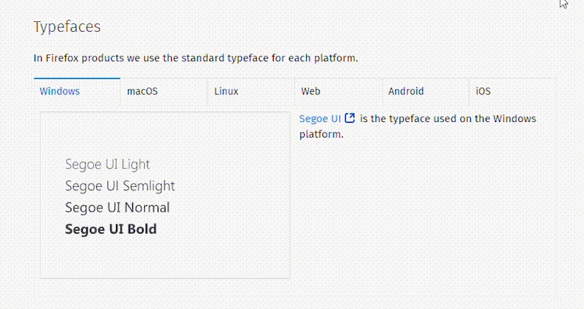

# Design System

É o documento vivo (sempre sofrerá alterações) com todos os componentes e propriedades de um produto ou serviço para facilitar a comunicação do time

## 1 Introdução

O Design System possui:

- Identidade
  - Cores
  - Tipografia
  - Imagens
  - Sons
  - Voz e tom
- Princípios
  - Valores
  - Princípios
  - Objetivos
- Melhores Práticas
  - Recursos
  - O que é UX
  - Treinamentos

### Introdução

#### Problemática

1. Falta de padronização das escolhas de design e componentes entre plataformas diferentes.
2. Inconsistência de layout em telas diferentes tirando o padrão visual do sistema.
3. Fluxo de trabalho lento focado em refinamento manual das interfaces nos programadas (Figma, Sketch, Adobe XD, etc).

#### Importância

1. Comunicação facilitada do time de produto
2. Criação de padrões visuais em diferentes sistemas
3. Agilidade na criação de design

#### Design Atômico

Metodologia para criar sistemas modulares.

##### Átomos

- Significam “aquilo que não pode ser dividido”.
- São os menores elementos dos layouts.
- São elementos isolados que não precisam de um contexto para existir.
- Exemplos: textos, imagens, ilustrações, ícones, formas, cores, sombras, grids e espaçamentos.
- São elementos que sozinhos não fazem sentido. Para um design system os átomos são a base para criação de elementos visuais. Por meio dele você distingue quais são as cores usadas, fontes, sombras, formas, etc.

##### Moléculas

- São agrupamentos de dois os mais átomos.
- As moléculas fazem componentes isolados funcionarem com um propósito.
- Uma molécula pode ser, por exemplo, um botão. Nele encontramos fonte, cores, formas e sombras - ou seja: diversos átomos agrupados que juntos formam um elemento maior.

As moléculas são construídas baseadas nas informações que estão presentes nos átomos em um design system. Dessa maneira o projeto inteiro passa a ter uma padronização visual consistente, respeitando e replicando as escolhas feitas nos átomos para as moléculas.

##### Organismos

- Da mesma maneira que uma molécula é um conjunto de átomos, um organismo é um conjunto de moléculas.
- Pode-se dizer que são sessões de uma tela.
- Pode ser, por exemplo, um `header`, um `footer` ou uma sessão isolada no design da página.
- Ao contrário das moléculas, um organismo pode ter diferentes propósitos: em um header podemos ter diversos tipos de elementos como: logo, navegação, formulário de login, campo de busca, botão, etc, e cada um deles pode realizar uma ação diferente.

##### Templates

- Aqui termina a analogia à ciência e a partir dessa etapa já começamos a ter um produto mais apresentável. Podemos dizer que um template é um wireframe de apenas uma das telas da interface.

##### Páginas

- São a evolução do template para um design de alta fidelidade. Aqui o layout já tem uma cara de produto final e é apresentado com diversos átomos, moléculas e organismos e com grande padronização visual. É possível criar fluxos navegáveis entre as páginas para que elas façam contexto em um protótipo de alta fidelidade.

- O Design Atômico auxilia na construção de um design system. Dessa maneira conseguimos definir qual a aparência visual dos menores elementos do layout (os átomos) e seguir com ela para os próximos elementos no Design Atômico.

- O design system, dessa maneira, se torna um documento altamente padronizado e confiável. Portanto é importante conhecer essa metodologia para estruturar a criação do design system.

### Roteiro de construção

1. Definição das diretrizes do sistema de design (parte conceitual)
2. Definição dos princípios de design (átomos)
3. Criação dos componentes (moléculas)
4. Definição dos organismos

### Diretrizes do sistema

---

## 2 Átomos

### Cores

### Tipografia

#### Fontes do Google x fontes do sistema

Saber escolher uma fonte para um projeto requer um estudo de como ela se comportará nos diferentes ambientes em que será exibida. Vamos pensar o seguinte exemplo: a empresa na qual eu trabalho é um serviço que possui um aplicativo para Android, outro para iOS e também um site.

Nesse caso, como decidir que fontes utilizar?

O Google Fonts oferece uma grande diversidade de fontes para serem utilizadas e são de fácil acesso para o desenvolvedor por já estarem hospedadas em um local. Portanto, há uma possibilidade de escolher fontes desse local e utilizar em todas as distintas aplicações (Android iOS e site). Isso torna o sistema com uma linguagem visual mais unificada que usa a mesma família tipográfica em diversos ambientes distintos, tornando o produto facilmente reconhecível.

Por outro lado, deve-se verificar como é a atuação dessas fontes nesses ambientes diversos. Para cada um desses ambientes há uma fonte padrão. Isso significa que cada sistema operacional indica qual a melhor fonte feita para ele. Por exemplo: o Android utiliza a fonte Roboto, o iOS usa a SF UI, o Windows usa a Segoe

*Design system do Firefox indica qual fonte usar em cada sistema operacional.*

Nessas circunstâncias é importante saber qual decisão tomar:

- Utilizar uma fonte apenas que atue em diversos cenários;
- Utilizar a fonte padrão para cada sistema.

Para isso, deve-se entender que, quando uma fonte que não é padrão do sistema estiver sendo utilizada, toda vez que o aplicativo carregar precisará fazer um chamado na internet para buscar essa família tipográfica. Na criação da estrutura do projeto pode-se também salvar os arquivos da família tipográfica dentro da pasta do projeto, permitindo que não seja necessário esse chamado, mas que ainda sim seja necessário carregar as fontes localmente.

Outro capricho que também deve ser feito no momento do desenvolvimento é para evitar o FOUC ou **Flash of Unstyled Content**. Ele pode fazer com que a página carregue primeiramente com a fonte padrão do sistema e só depois carregar a nova fonte e exibir, o que pode causar certo desconforto no usuário.

### Sombras

### Grids

---

## 3 Átomos

### Imagens

### Ilustrações

### Ícones

---

## 4 Componentes (Moléculas)

### Botões

### Cards

### Inputs

### Navegação

### Teclados

---

## 5 Finalização

### Refinamento

### Organismos

### Organizando páginas

### Handoff

### Conclusão
