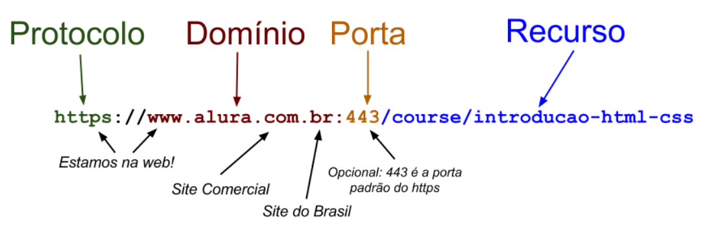
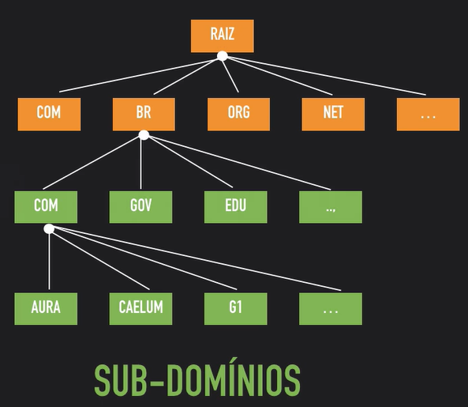
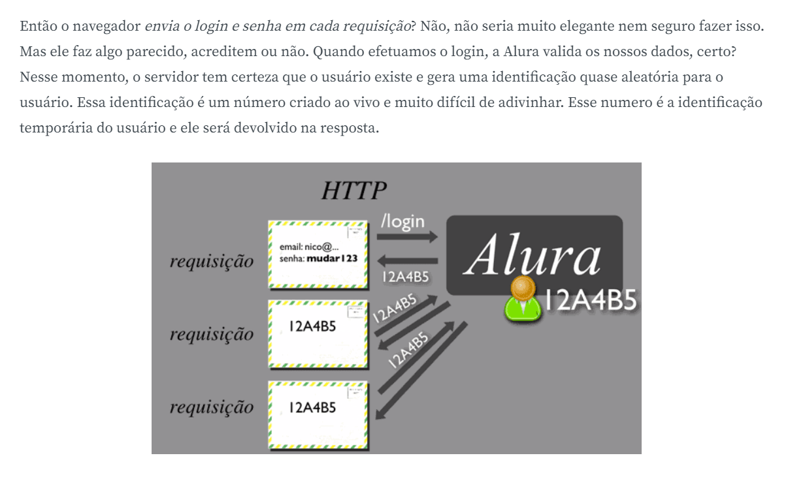
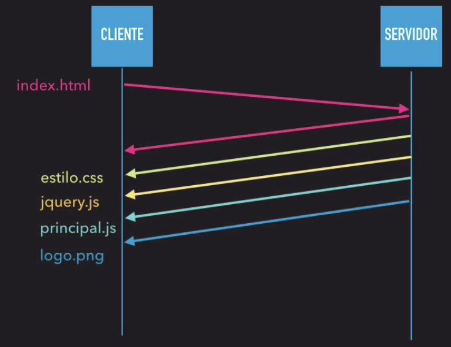
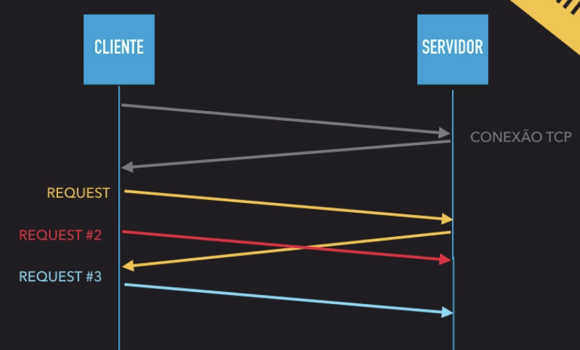
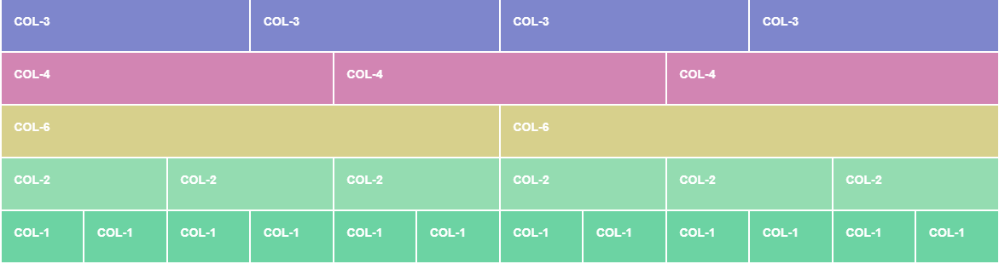

<div align="center">
  
</div>

<br>

<details>
  <summary>HTML</summary>

## `<fieldset>`
- Configuração de um ou mais campos referentes a um assunto específico em um formulário
- Um assunto e seus vários campos

## `<legend>`
- Título de um `<fieldset>`
- Título de um grupo de campos no formulário

## `<div>`
- Divisão apenas visual

## `<section>`
- Divisão em que há um conteúdo complexo (semânticamente faz um mesmo sentido como um todo)

## `aria-`
- Atributos que começam com `aria` estão relacionados a leitores de tela (acessibilidade)

## `object-fit`
- Como o elemento se comporta em relação ao seu contêiner

## `object-position`
- Permite a movimentação de imagens em seus eixos X (horizontal) e Y (vertical)

## `data-`
- Possibilita adicionar informações customizadas/dinâmicas no DOM, sem utilizar classes nem IDs

## Modal

"Caixa" que aparece por cima da janela atual

### Modal X Pop-up

A **modal** aparece na tela e bloqueia tudo que está atrás dela

</details>

<details>
  <summary>HTML - CSS</summary>

### Nível de "força"
- inline > id > class > tag (1000 > 100 > 10 > 1)
  - **Exemplo:**
    - `p` 1
    - `form p` 1 + 1 = 2 -> maior força, especificidade

## `em`
- Unidade de medida dinâmica
- Se baseia em um tamanho de fonte-base

```html
<body>
  <div>texto</div>
</body>
```

```css
body {
  font-size: 14px;
}

div {
  font-size: 2em;
}
```

Segundo este exemplo, o texto dentro de `div` terá tamanho de `2em`. O que define qual o valor de 2, nesse caso, é o valor inicial de `font-size` declarado em `body`, ou seja, `14px`. Então no exemplo acima `div` terá um valor de `font-size` de `28px` (14px x 2em). Basicamente, o que estamos dizendo para o CSS é que cada `em` tem um valor inicial de 14px

```html
<body>
<div> //font-size: 2em x 14px = 28px
        <div> //font-size: 2em x 28px = 56px
              <div> //font-size: 2em x 56px = 112px
                    texto
              </div>
        </div>
      </div>
</body>
```

Quando declaramos a unidade de medida como `em`, cada elemento herda o tamanho de fonte de seu elemento-pai. Isso permite que todos os elementos em que utilizamos essa medida (pode ser fonte, altura, largura, qualquer caso em que se pode aplicar unidades de medida no CSS) aumentem ou diminuam de tamanho de forma proporcional. Legal, né? Porém às vezes não queremos isso!

## `rem`

- *root em*

Podemos especificar um font-size no elemento mais externo do nosso HTML (normalmente na tag `<html>`) e todos os elementos seguirão somente esse valor

```css
html {
  font-size: 14px;
}

div {
  font-size: 2rem;
}
```

```html
<body>
<div> //font-size: 2em x 14px = 28px
        <div> //font-size: 2em x 14px = 28px
              <div> //font-size: 2em x 14px = 28px
                    texto
              </div>
        </div>
      </div>
</body>
```

Quando utilizamos em ou rem sem declarar um tamanho de fonte, o CSS utiliza por padrão a medida de 16px = 1em e 16px = 1rem. Como você já deve ter imaginado, podemos personalizar essa medida inicial de acordo com nosso projeto

```css
html {
  font-size: 25px; //cada em ou rem equivale a 25px
}
```

Ou

```css
html {
  font-size: 25vw; //cada em ou rem equivale a 25% da largura do viewport
}
```

</details>

<details>
  <summary>CSS</summary>

### Cálculos
  - `calc(operações desejadas)`

---

### `position`
- `static`
  - Posição natural/padrão do elemento

- `relative`
  - **Exemplo:**
    - Depois de tal elemento carregado, deseja-se mudar o ponto inicial dele a partir do ponto inicial
    - 'Olha' a partir do ponto inicial, mas tem uma nova posição que é relativa a aquela posição inicial
    - Elemento está deslocado, mas o ponto inicial continua onde deveria estar

- `absolute`
  - Nos possibilita mudar a posição inicial em que determinado elemento se encontra
  - Posicioná-lo em qualquer lugar da página
  - **Exemplo:**
    - Ser absoluto em relação a página toda;
    - em relação ao cabeçalho, etc

### `display`
  - `inline-block`
    - Um elemento com essa propriedade possui o tamanho do seu conteúdo, mas regulável
    - O tamanho pode ser ajustado, tanto na largura, quanto na altura

### `box-sizing`
  - `border-box`
    - As propriedades de `width` e de `height` incluem o tamanho padding size e a propriedade `border`, mas não incluem a propriedade `margin`.
    - O espaçamento lateral passa a ficar dentro do percentual

### `clear`
  - Limpa os elementos que estavam sendo afetados pelo `float`
  - Elementos que não deveriam ser afetados (abaixo dele)

### `background`
  - `linear-gradient(graus - inclinação, cor, cor, cor, etc)`: transição de uma cor para outra
  - `radial-gradient(cor, cor, cor, etc)`: transição de uma cor para outra (radial - redondo)

### `!important`
- Permite com que determinada propriedade no CSS "passe por cima" de todas as outras já aplicadas para ele
---

### Pseudo-classes
  - `:active`: quando um elemento está sendo ativado pelo usuário
  - `:nth-child(numero do elemento)`: selecionar um elemento específico de um lista, por exemplo

---

### Pseudo-elementos
- **Elementos criados no CSS que não existem no HTML**

  - `:first-letter`: primeira letra de um texto
  - `:first-line`: primeira linha
  - `:before`: Cria um espaço antes do elemento onde o CSS pode ser usado
  - `:after`: Cria um espaço depois do elemento onde o CSS pode ser usado

---

### Seletores avançados
- `>`
  - **Selecionar filhos diretos do elemento pai**
  - **Exemplo:**
    ```
    main > p {
      background: red;
    }
    ```

- `+`
  - **Selecionar 1º irmão de determinado elemento**
  - Todo parágrafo que vem após uma imagem
  - **Exemplo:**
    ```
    img + p {
      background: blue;
    }
    ```

- `~`
  - **Selecionar todos os irmãos de determinado elemento**
  - Todos os parágrafos que vem após uma imagem
  - **Exemplo:**
    ```
    img ~ p {
      background: blue;
    }
    ```

- `:not()`
  - **Selecionar todos os elementos, exceto algum**
  - Todos os parágrafos que não fazem parte da missão, não possuem o `id` `missao` => `#missao`
  - **Exemplo:**
    ```
    principal p:not(#missao) {
      background: orange;
    }
    ```

</details>

<details>
  <summary>HTTP</summary>

  **Hypertext Tranfer Protocol**

  - Carrega apenas texto puro
  - É independente de plataforma de desenvolvimento
  - Estabelece regras de comunicação entre o cliente e servidor

## HTTPS

- HTTP + SSL/TSL (**Hypertext Transfer Protocol + Secure Sockets Layer/Transport Layer Security**)

- Carrega dados criptografados
- Usa ambos os métodos de criptografia, **assimétrica** e **simétrica**
  - Inicia com a criptografia assimétrica para depois mudar para a criptografia simétrica. Essa chave simétrica será gerada no início da comunicação e será reaproveitada nas requisições seguintes

- **Certificado digital** (identidade)
  - Guarda a chave pública
  - Possue uma data validade e serve para provar a identidade entre o cliente e o servidor

- Chaves
  - Estão *ligadas* matematicamente
  - O que foi cifrado pela chave pública só pode ser decifrado pela chave privada

  - **Pública**
    - Cliente
    - Utilizada para criptografar os dados

  - **Privada**
    - Servidor
    - Usada para descriptografar os dados que foram criptografados com a chave pública

- Criptografia
  - **Assimétrica**
    - 2 chaves diferentes envolvidas
    - Problema: é lenta

  - **Simétrica**
    - Usa a mesma chave para cifrar e decifrar os dados
    - Muito mais rápida
    - Não tão segura
      - Como existe apenas uma chave, ela ficará espalhada pelos clientes (navegadores) e qualquer um, que tem a posse dessa chave, pode decifrar a comunicação

- Autoridades certificadoras
  - Órgãos
  - Garantem que podemos confiar naquele determinado certificado (identidade)
  - Essa assinatura é feita através de uma **assinatura digital**
  - A autoridade certificadora **assina digitalmente** o certificado

## Endereço



- Domínio
  - Nome do site na web
  - Serve para facilitar a navegação do usuário, que acaba não precisando lembrar o IP de cada site

  - **Raiz**
    - Parte final do endereço

    

## DNS

- **Domain Name Server**
- Realiza a tradução do nome de um domínio para o endereço de IP
- Existem vários servidores DNS no mundo

## Portas

`http://www.alura.com.br:80`

`https://www.alura.com.br:443`

- Porta padrão: 80 (HTTP)
- Porta padrão: 443 (HTTPS)

## Recurso

`https://www.alura.com.br:443/course/introducao-html-css`

- Algo concreto que se quer acessar

## URL X URI X URN

- Uma URL é uma URI mas nem todas as URI's são URL's
- Existem URI's que identificam um recurso sem definir o endereço, nem o protocolo


### URL (Uniform Resource Locator)

- Representa uma identificação de um recurso (URI) através do endereço, mas nem todas as identificações são URL's

### URN (Uniform Resource Name)

- Também são URI's
- `urn:cursos:alura:course:introducao-html-css`
- Outra identificação do curso Introdução ao HTML e CSS da Alura, mas essa identificação não é um endereço

## Requisição (Request) e Resposta (Response)

- Uma **requisição** precisa ter **todas as informações** para o servidor gerar a resposta
- Cliente (requisição) -> espera -> servidor (resposta)

- HTTP não guarda um estado (stateless)
  - Não mantem informações entre as requisições
  - Quando é feita uma requisição, esta não sabe o que foi feito em uma requisição anterior
  - Cada requisição é única

### Sessão

- Manter dados entre as diversas requisições
- Um tempo que o cliente permanece ativo no sistema
- Principal método utilizado é o **cookie**



#### Cookie

- Pequeno arquivo de texto, normalmente criado pela aplicação web, para guardar algumas informações sobre o usuário no navegador
- Essas informações dependem do tipo de aplicação
  - Código da sessão (identificação do usuário), que determinado que determinado usuário está logado (`session-id` ou `PHPSESSID` ou `ASP.NET_SessionId` ou `JSESSIONID`, etc)
  - Alguma preferência do usuário
  - Informações sobre as compras numa loja virtual
  - etc

- Fica associado a um domínio

### Status Code

- 200 - OK
- 300 - Moved Permanently (É feita uma nova requisição)
- 404 - Not Found (URL inválida ou recurso inexistente)
- 500 - Internal Server Error (Erro interno da aplicação)

---

- 2XX - Successful responses (a ação solicitada pelo cliente foi recebida, compreendida, aceita e processada com êxito)
- 3XX - Redirection messages (cliente precisa fazer algo a mais, pois algo mudou ou um recurso não existe mais)
- 4XX - Client error responses (navegador enviou dados errados)
- 5XX - Server error responses (Erro no servidor)

## Parâmetros da requisição

- Usados para definir detalhes da pesquisa ou enviar dados de um formulário

## Métodos HTTP

- GET
  - Usado na busca de informações (listagem, por exemplo)
  - Receber dados
  - **- Envia parâmetros pela URL**
    - Usa-se `?` e concatena-se com `&`

- POST
  - Submeter dados
  - Criação de uma nova informação
  - Login - preenchimento de formulário
  - O envio dos parâmetros é feito no **corpo da requisição**
    - **Não são enviados pela URL**

- PUT
  - Atualizar um recurso

- DELETE
  - Deletar um recurso

## Web Service

- Usa o HTTP
- Disponibiliza uma funcionalidade na web
  - Variam muito e dependem muito da empresa e do negócio dela
- A grande diferença de um Web Service é que os dados **não** vem no formato HTML, e sim em algum formato independente da visualização, como XML ou JSON

## Serviços REST (Representation State Transfer)

- Padrão arquitetura para comunicações entre aplicações
- Aproveita da estrutura que o HTTP proporciona
- Recursos são definidos via URI
- Operações com os métodos HTTP (GET, POST, PUT, DELETE)
- Cabeçalhos (Accept/Content-Type) para especificar a representação (JSON, XML, ...)


### URI + Método
- `http://alurafood.com/api/restaurante` - **GET** -> Pede todos os restaurantes

- `http://alurafood.com/api/restaurante/1/cardapio` - **GET** -> Pede o cardápio do restaurante 1

- `http://alurafood.com/api/restaurante` - **POST** -> Adiciona um novo restaurante

- `http://alurafood.com/api/restaurante/1` - **PUT/PATCH** -> Atualiza o restaurante 1

- `http://alurafood.com/api/restaurante/1` - **DELETE** -> Remove o restaurante 1

### Cabeçalhos

Em alguns cabeçalhos do **HTTP** devemos especificar algum formato. Os formatos são chamados na documentação de **MIME types**. E na definição do cabeçalho usamos a seguinte estrutura: `tipo/subtipo`.

Tipos
- `text, image, application, audio e video`

Subtipos
- `text -> text/plain, text/html, text/css, text/javascript`
- `image -> image/gif, image/png, image/jpeg`
- `audio -> audio/midi, audio/mpeg, audio/webm, audio/ogg, audio/wav`
- `video -> video/mp4`
- `application -> application/xml,  application/pdf`

## HTTP/2

- Atua sobre o que já se conhece do HTTP

- Possui diversas tecnologias de compactação de sua requisição. Isto acaba sendo muito útil para clientes móveis, visto que a maioria das redes mobile ainda não são de grande qualidade.

- Corpo da **resposta** de uma requisição é comprimido usando o algoritmo **GZIP**
- Requisições e respostas
  - **TLS** (criptografia)
  - Cabeçalhos
    - **binários** (não mais em texto puro)
    - **HPACK** (compressão)

### Headers Stateful

No caso dos cabeçalhos, o estado deles é guardado

- Requisição
  - Não é necessário enviar novamente/repetir o(s) mesmo(s) cabeçalhos que já foi(ram) enviados em uma requisição passada
  - São enviados apenas os cabeçalhos que são diferentes a cada requisição, o que acaba economizando dados

### Server Push

- O servidor envia dados para o cliente sem que o cliente tenha solicitado, tornando o tráfego de dados muito mais otimizado

- Ele pode empurrar para o clientes certos recursos antes mesmo de serem solicitados, pois ele consegue analisar o HTML e ver o que mais é preciso para carregar a página fazendo com que não seja necessário gastar tempo pedindo todos os outros recursos

#### Antes

- Requisições seriais
- Fazíamos uma requisição e esperávamos receber a resposta, fazíamos outra requisição e esperávamos receber e por aí vai

#### Depois

- No HTTP2, quando o cliente realiza uma requisição para `index.html`, o servidor devolve a página, mas ele já pode passar para o browser as informações necessárias (imagens, CSS, JavaScript, etc) para que essa página possa ser, de fato, exibida. Ou seja, ele consegue dar um passo além



- Mas quando o browser for interpretar essa página HTML, vai ter que passar pelo conteúdo que especifica o arquivo CSS? Sim, mas quando ele passar pelo `estilo.css`, vai verificar que já recebeu. Ou seja, ele percebe que já recebeu essas informações

### Multiplexação

- Requisição e respostas paralelas

- Não é necessário esperar terminar uma requisição para dar início a próxima, elas ocorrem em paralelo juntamente com as respostas

#### Keep-Alive

- Determina quanto tempo, por exemplo, a nossa conexão pode ficar ativa. Ou seja, não encerra a conexão **TCP** (“por baixo dos panos”, antes de cada **requisição** de fato ser feita, há uma conexão, comunicação entre **cliente** e **servidor**, TCP). Portanto, conseguimos realizar várias requisições com a mesma conexão TCP

##### Keep-Alive No HTTP/2

- Se temos uma conexão TCP aberta e realizamos uma requisição, poderíamos já dar prosseguimento às próximas requisições, isso em paralelo, sem de fato ficar esperando o resultado dela, de maneira assíncrona, e vamos recebendo essas respostas à medida em que o servidor for conseguindo processar

- Então, essas requisições e respostas vão chegando a todo tempo. É totalmente paralelo. A mesma coisa acontece com o servidor, não precisamos esperar uma resposta para enviar outra. Se já está pronta para ser enviada, ele já envia diretamente



</details>

<details>
  <summary>Bootstrap</summary>

- [Site oficial](https://getbootstrap.com/)

  ## Grid

  
</details>

<details>
  <summary>JavaScript</summary>

  ## `querySelector`
  Realiza a busca na DOM através de seletores CSS

  ## `textContent`
  - Acessar o texto de um elemento
  - `element.textContent`

  ## `classList`
  - Acessar a lista de classes de um elemento
  - `element.className`

  ## `createElement`
  - Criar elementos HTML
  - `var elemento = document.createElement("div")`

  ## `innerHTML`
  - Define ou obtém a sintaxe HTML ou XML descrevendo os elementos descendentes
  - `element.innerHTML`

  ## Bubbling
  Este princípio diz que depois que um evento é disparado no elemento mais distante de uma cadeia aninhada do DOM ele é disparado em seus elementos ancestrais na ordem crescente de aninhamento.

  ```html
  <div class="d1">1  <!-- ancestral mais alto -->
        <div class="d2">2
            <div class="d3">3 <!-- descendente mais baixo -->
            </div>
        </div>
    </div>
  ```

</details>

<details>
  <summary>jQuery</summary>

  - Compatibilidade entre todos os navegadores
  - Produtividade
    - Escrever menos código do que se fosse escrito em javascript puro

  ## `.text()`
  - [Documentação](https://api.jquery.com/text/)
  - Tanto altera como pega o valor do texto de elementos
  - Pega o conteúdo de texto de tags HTML que tem texto dentro, como as `<h1>`, `<span>` e `<p>`

  ## `.val()`
  - [Documentação](https://api.jquery.com/val/)
  - Tanto altera como pega o valor do texto de elementos
  - Funciona em elementos de `<input>` que são campos aonde o usuário do site insere dados, como os campos de `<input>`(todos os tipos), `<textarea>` e `<select>`

  ## `.on()`
  - [Documentação](https://api.jquery.com/on/)

  ## `.one()`
  - [Documentação](https://api.jquery.com/one/)
  - Executa determinado evento apenas 1 vez

  ## `.focus()`
  - Usado para detectar quando o usuário entra em um campo, não necessariamente digitando

  ## `.attr()`
  - Acessa os atributos de um elemento

  ## `.addClass()`
  - Adiciona uma classe a um elemento

  ## `.removeClass()`
  - Remove uma classe de um elemento

  ## `.toggleClass()`
  - Adiciona ou remove uma ou mais classes de cada elemento no conjunto de elementos correspondentes, dependendo da presença da classe ou do valor do argumento de estado
  - Se determinado elemento estiver com a classe, ela é removida. Caso não esteja com ela, ela é adicionada

  ## `.startsWith()`
  - Comparar se a `string` de determinado elemento começa com a `string` de outro

  ## `.find()`
  - Busca na DOM (a partir de um elemento especificado) por outro elemento
</details>

<details>
  <summary>Asp.NET Core</summary>
  
  ## MVC (Model View Controller)
  
  ### Model
  - Classes de negócio
  - Elas modelam a aplicação
  
  ### View
  - Classes e arquivos para tratar da parte que o usuário visualiza
  
  ### Controller
  - A lógica de controle/atendimento das requisições
  
  ---
  
  ## Estágios de execução do framework
  
  - O Framework é que trata as respostas das requisições
  
  ### Execute Result
  - Etapa que ocorre depois da execução da **action**
  
  
<details/>
