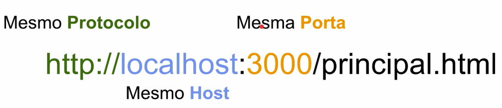

# Same Origin Policy

- Proteção do navegador contra scripts maliciosos (não são da mesma **origem**)

## CORS - Cross Origin Resource Sharing

- Configuração no servidor para permitir requisições de **determinadas origens**

- Header requisição HTTP
  - Access-Control-Allow-Origin: `http://www.hsbc.com.br` (exemplo)
    - Somente aceita requisições deste endereço
